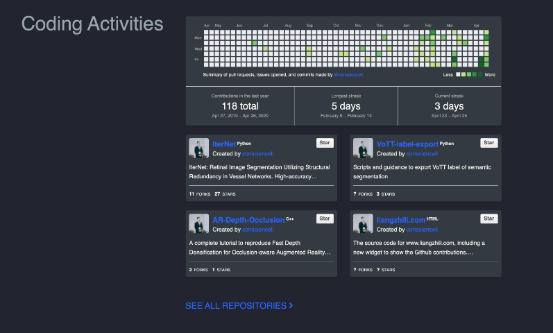

The source code of a [website](https://www.liangzhili.com) using Hugo [Academic](https://github.com/gcushen/hugo-academic) theme.

A new custom widget to show the Github activities. (Thanks the work of [Bloggify/github-calendar](https://github.com/Bloggify/github-calendar) and [lepture/github-cards](https://github.com/lepture/github-cards))

### Widget Preview





### Usage

modify `content/home/coding-activities.md`

```python
+++
# Coding-activities widget.
widget = "coding-activities"  # See https://sourcethemes.com/academic/docs/page-builder/
headless = true  # This file represents a page section.
active = true  # Activate this widget? true/false
weight = 41  # Order that this section will appear in.

title = "Coding Activities"

# Choose the user profile to display
# This should be the username of a profile in your `content/authors/` folder.
# See https://sourcethemes.com/academic/docs/get-started/#introduce-yourself
author = "admin"

user = "user"
client_id = "" #app_id
client_secret = "" #app_secret

[[item]]
repo = "repo1"
hide_on_mobile = false
order = 1

[[item]]
repo = "repo2"
hide_on_mobile = false
order = 2

[[item]]
repo = "repo3"
hide_on_mobile = true
order = 3

[[item]]
repo = "repo4"
hide_on_mobile = true
order = 4

+++

```